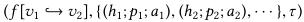

# **IOTA: A Calculus for Internet of Things Automation**

Abstract

프로그램적으로 제어할 수 있는 홈 디바이스가 점점 더 확산되고 있다. 조명,
도어록, 모션 센서부터 스마트 냉장고, TV, 카메라에 이르기까지 다양한
기기가 등장하면서 사용자들은 자신의 환경을 전례 없이 세밀하게 제어할 수
있게 되었다. 이를 설정하기 위해 범용 프로그래밍 플랫폼을 대체할 수 있는
새로운 도메인 특화 언어(DSL)가 등장하고 있으며, 이러한 언어들은
이벤트-조건-액션(event-condition-action, ECA) 규칙을 기반으로 하여
단순하면서도 직관적인 특성을 가지고 있다.

그러나 프로그래밍이 가능해지면서 사용자들은 버그가 포함된 프로그램을
작성할 위험이 커지며, 소프트웨어 개발에서 흔히 겪는 어려움을 적절한 도구
지원 없이 마주하게 된다. 또한, 홈 자동화 도메인의 미묘한 의미적 차이뿐만
아니라, 다양한 홈 자동화 플랫폼이 사용하는 인터페이스와 구현 전략의
차이로 인해 이러한 문제는 더욱 심화된다.

본 연구에서는 홈 자동화 도메인을 위한 최초의 계산 체계인 IOTA(Internet
of Things Automation) 계산법(calculus)을 제안한다. IOTA는 ECA 언어를
모델링하며, 시간, 상태, 디바이스 집계를 일급(first-class) 개념으로
포함하는 명확한 의미론을 제공한다. 또한, 기존 다섯 개의 홈 자동화
플랫폼을 면밀히 분석하여 이를 반영한 의미론을 설계하였다.

우리는 IOTA 계산법이 유용함을 증명하기 위해 소프트웨어 공학 문헌에서 두
가지 분석 기법을 구현하였으며, 또한 16개의 홈 자동화 플랫폼 프로그램을
인코딩하여 그 표현력이 뛰어남을 보여준다. 연구 과정에서 우리는 IOTA의
의미론적 설계가 특정 유형의 미묘한 버그를 방지하는 데 기여함을 강조한다.

**1 서론**

저렴한 컴퓨팅 하드웨어와 유비쿼터스 인터넷 연결의 보급으로 인해, 가정 내
기기---전구, 전원 콘센트, 모션 감지기, 오븐, 냉장고, 식기세척기 등---를
스마트폰 및 인터넷에 연결하는 것이 기술적으로 가능하고 상업적으로도 실현
가능한 시대가 되었다. 이러한 연결은 사물인터넷(IoT, Internet of
Things)의 발전을 촉진하며, 사용자들이 스마트폰을 통해 원격으로 가정을
제어하는 것은 물론, 특정 일상 작업을 자동화할 수 있도록 한다. 예를 들어,
사용자가 집에 돌아오면 조명을 자동으로 켜거나, 아이들이 학교에서
돌아왔을 때 이를 알림으로 받거나, 해가 진 후 비가 내리지 않았다면 정원을
자동으로 물 주는 등의 자동화 기능을 구현할 수 있다. 이상적으로는,
프로그래밍에 익숙하지 않은 일반 사용자들도 이러한 자동화 및 개인화를
손쉽고 효율적으로, 그리고 즐겁게 설정할 수 있어야 한다.

본 논문에서는 IoT 자동화를 위한 핵심 계산 체계(IOTA 계산법)을 정의한다.
IOTA 계산법은 이벤트-조건-액션(ECA) 언어를 일반화한 모델로, 홈 자동화
애플리케이션에서 중요한 시간, 상태, 디바이스 집계(device aggregation)를
매우 우수한 품질로(일급 개념으로) 지원한다. 우리는 IOTA 계산법을 위한
명확한 의미론을 정의하고, 이를 활용하여 일반 사용자들을 위한 유용한
도구를 개발하며, 기존 홈 자동화 플랫폼에서 사용되는 프로그램(ECA 기반 및
범용 프로그래밍 플랫폼 모두)이 IOTA 내에서 자연스럽게 인코딩될 수 있음을
보인다.

**프로그래밍 가능성의 스펙트럼**

최근 몇 년 동안 홈 자동화 시장은 대기업과 스타트업뿐만 아니라 오픈 소스
솔루션까지 포함하여 빠르게 성장하고 있다. 홈 자동화를 구현하는 한 가지
자연스러운 방법은 범용 프로그래밍 언어에 API를 추가하여 물리적 기기 및
가전제품과 상호 작용할 수 있도록 하는 것이다. 그러나 스마트 홈
애플리케이션은 본질적으로 반응형(reactive)이며, 동시성 공유
메모리(concurrent shared-memory systems) 및 복잡한 타이밍 제약을 가진
시스템이다. 예를 들어, Samsung SmartThings 튜토리얼에서는 사용자가
다음과 같은 프로그램을 구현하도록 가르친다.

"When everyone leaves the house for more than ten minutes, turn the
lights off."

\"모두가 집을 떠난 지 10분이 지나면 조명을 끈다.\"

이를 구현하기 위해서는 락(lock), 타이머(timer), 인터럽트(interrupt),
변경 가능한 상태(mutable state) 등에 대한 정교한 추론이 필요하며, Groovy
코드 100줄 이상을 작성해야 한다. 이러한 방식은 지루하고 오류가 발생하기
쉬울 뿐만 아니라, 일반적인 반응형 프로그래밍은 검증 및 도구 지원이 매우
어렵다. 또한, 프로그래밍 경험이 없는 일반 사용자들에게는 접근이 어렵다.

한편, 반대편 스펙트럼에서는 일부 제조업체가 제3자 개발자 또는 제조업체
자체에서 프로그래밍한 애플리케이션을 판매하는 방식을 채택하고 있다. 이는
스마트폰 시장에서 성공적으로 정착한 모델이기도 한다. 하지만, 각 가정의
환경과 사용자의 생활 습관이 다르기 때문에, 다운로드 가능한 앱들은 너무
특정한 기능만 제공하거나, 충분한 맞춤형 설정을 지원하지 못하는 경우가
많다\[20\].

이벤트-조건-액션(ECA) 규칙 시스템은 비전문가들이 홈 자동화 시스템을
설정하고 제어할 수 있는 간단하고 실용적인 방법으로 인기를 끌고 있다.
대표적인 예로는 IFTTT 서비스, SmartThings용 Smart Lights, Muzzley,
Yonomi 등의 스마트폰 애플리케이션이 있다. 이들 서비스는 사용자가 다음과
같은 단순한 규칙을 쉽게 설정할 수 있도록 지원한다.

"**when** some event occurs **if** some condition is true **then**
perform some action."

\"어떤 이벤트가 발생하면, 특정 조건이 충족될 경우, 특정 동작을
수행한다.\"

이러한 규칙 기반 시스템은 범용 프로그래밍 언어보다 배우기 쉬우면서도,
일정 수준의 맞춤 설정이 가능하여 적절한 절충점을 제공한다. 물론, 범용
프로그래밍 플랫폼이 가장 강력한 표현력을 갖추고 있긴 하지만, 대부분의 홈
자동화 프로그램에서는 이러한 수준의 복잡성이 필요하지 않다. 우리는 앱
스토어, 사용자 포럼, GitHub에서 범용 프로그래밍 언어로 작성된 홈 자동화
애플리케이션을 조사한 결과, 대부분이 이벤트-조건-액션(ECA) 규칙 시스템
내에서 충분히 표현 가능하다는 사실을 발견했다.

**형식적 분석(Formal Analysis)의 필요성**

이벤트-조건-액션(ECA) 프레임워크는 표현력과 사용 편의성 간의 균형을 잘
유지하는 접근 방식이다. 그러나 이러한 시스템은 일관된 설계 원칙 없이(ad
hoc) 개발된 경우가 많다. 즉, 규칙의 표현력(expressivity)이 플랫폼마다
다르며, 실행 방식의 의미론(semantics)도 다양한다. 예를 들어, 우리가
조사한 다섯 개의 홈 자동화 플랫폼 중 세 개는 피할 수 있는 설계 결정으로
인해 불필요하게 발생하는 경쟁 조건(race condition)을 포함하고 있었으며,
네 번째 플랫폼은 결정론적이지만 예측하기 어려운 동작을 보였다(4.2절
참고).

이러한 차이점 때문에 사용자 경험이 일정하지 않으며, 일부 사용자는 예상치
못한 문제를 겪을 가능성이 크다. 단일 규칙을 작성하는 것은 쉬울 수
있지만, 사용자는 대규모 프로그램에서 여러 규칙을 관리하는 데 어려움을
겪고, 충돌하는 규칙을 만들기 쉽다\[13\]. 또한, 규칙은
선언적(declarative)이지만, 더 큰 구조 내에서 그룹화되지 않기 때문에
프로그램이 예상과 다르게 동작할 경우 디버깅이 매우 어렵다. Brush
등\[3\]이 홈 오토메이션을 사용하는 가정을 대상으로 실시한 연구에 따르면
사용자는 예상대로 동작하는 프로그램을 작성하는 데 어려움을 겪는 것으로
나타났다. \"참여자들은 규칙이 예상대로 작동하지 않을 때 이를 디버깅하는
것이 어렵다고 느꼈으며, 결국 문제를 감수하거나 규칙을 비활성화하는
경향을 보였다. 한 참여자는 만약 시스템을 실험하는 방법을 알았다면 다양한
장면(scenes)을 테스트해 보고 싶었을 것이라고 말했다.\"

우리는 명확한 의미론(semantics)을 제공하는 것뿐만 아니라, 홈 자동화
프로그램의 디버깅 및 검증 도구가 홈 자동화가 널리 보급되는 데 중요한
역할을 할 것이라고 믿고 있다. 이러한 도구들은 사용자가 잠재적 버그를
조기에 탐지하고, 과거의 동작을 깊이 분석할 수 있도록 지원하여,
프로그램이 기대한 대로 작동할 것이라는 확신을 가질 수 있도록 해준다.
그러나 범용 프로그래밍 플랫폼에서 이러한 도구를 개발하는 것은 어려운
문제이다. 홈 자동화 프로그램은 동시성(concurrency), 비동기
콜백(asynchronous callbacks), 공유 변경 가능 상태(shared mutable state)
등 분석이 어려운 언어적 특성을 결합하고 있기 때문이다. 한편, ECA 언어는
제한적인 특성으로 인해 분석이 더 용이한 장점이 있다. 하지만 현재 등장한
일부 ECA 언어는 제한이 너무 심해 일반적인 사용 패턴(예: 경과 시간
처리)을 표현하는 것이 어렵다는 문제점도 존재한다.

**기여 사항(Contributions)**

우리는 우리가 아는 한 홈 자동화 분야에서 최초의 형식적(formal) 계산
체계인 IOTA 계산법(IOTA calculus)을 제안한다. IOTA는
이벤트-조건-액션(ECA) 문법과 명확한 의미론(semantics)을 갖춘 정식 정의된
ECA 언어이다. 또한, 시간(time), 공유 상태(shared state, 단 할당 불가능한
상태), 디바이스 집계(device aggregation)를 지원하며, 기존 시스템에서
흔히 발생하는 경쟁 조건(race condition)을 방지하도록 의미론을 신중하게
설계하였다. IOTA는 특정 플랫폼에 종속되지 않으며(home automation
플랫폼의 선택에 구애받지 않으며), 홈 자동화 프로그램이 특정 장치와
통신할 수 있고, 모든 통신이 중앙 허브(central hub)를 통해 이루어진다는
가정만을 둔다. 우리는 IOTA 프로그램을 구문 해석하고, 환경 설정에 따라
이벤트 시퀀스를 실행할 수 있는 시뮬레이터를 구현하였다. 다만, 현재 실제
하드웨어 장치와의 바인딩(bindings)은 작성하지 않았다. IoT
자동화프로그램은 프로그래밍에 어느 정도 익숙한 사용자가 IOTA로 직접
작성할 수 있으며, 기존 비교 대상 플랫폼들과 비교했을 때 사용성이 우수한
것으로 판단된다. 그러나 IOTA는 궁극적으로 더 높은 수준의 언어 또는 보다
정교한 GUI 기반 시스템의 핵심 구성 요소로 활용될 때 가장 유용할 것이라
기대된다.

우리는 다섯 개의 기존 홈 자동화 플랫폼(IFTTT, Smart Lights for
SmartThings, Home Assistant, OpenHAB, SmartThings Apps)과 IOTA를
비교한다. IOTA의 표현력을 평가하기 위해 이 다섯 개 플랫폼의 사용자
커뮤니티에서 수집한 16개의 홈 자동화 프로그램을 IOTA로 변환하였다. 원본
프로그램과 변환된 프로그램의 코드 크기를 비교하고, IOTA가 범용 홈 자동화
프로그램을 표현하는 데 부족한 언어적 기능이 무엇인지 분석하였다. 그
결과, IOTA는 특정 도메인에 대한 제한에도 불구하고 표현력이 뛰어나고
코드가 간결함을 확인할 수 있었다. 변환된 프로그램은 원래 작성된 코드보다
상당히 짧아지는 경향을 보였다.

우리는 IOTA 및 그 형식성(formalism)을 기반으로 두 가지 분석 기법을 개발,
구현 및 평가하였다.

- 충돌 감지(conflict detection): 특정 이벤트가 두 개의 충돌하는 동작을
  수행하는 실행을 트리거할 수 있는지 판단한다.

- 긍정 및 부정 쿼리(positive and negative queries): 특정 이벤트가
  발생했거나 발생하지 않은 근본 원인을 규칙 실행과 중간 이벤트를
  추적하여 분석한다.

**2 최신 기술 현황(Current State of the Art)**

우리는 현재 홈 자동화 프로그래밍에서 사용되는 다섯 개의 대표적인
플랫폼을 선정하여 분석하였다. 이들 플랫폼은 아주 제한적인 규칙 문법에서
범용 프로그래밍 언어의 강력한 표현력까지 다양한 지점에 위치하고 있으며,
실제 규모가 큰 사용자층을 보유하고 있고, 상업적으로 이용 가능하거나 오픈
소스로 제공되는 플랫폼이다. 각 플랫폼의 주요 기능을 간략히 검토하여,
현재 홈 자동화 프로그램이 어떻게 작성되는지를 보여주고, IOTA의 설계 및
분석 도구 개발 과정에서의 선택을 정당화하고자 한다.

**IFTTT** (If This Then That)

IFTTT는 API를 연결하는 서비스이다. 스마트하고 클라우드에 연결된 장치들은
IFTTT에 서비스를 게시하며, 특정 이벤트가 발생하거나 조건이 충족될 때
발생하는 트리거(trigger, 이벤트)와 장치의 일정한 필드를 업데이트하는
액션(action)을 제공한다. IFTTT 규칙은 단순히 하나의 트리거를 하나의
액션과 연결하는 방식으로 동작한다. 조건문(conditions)을 자체적으로
포함하지 않으며, 대신 제조업체에서 제공하는 트리거 및 액션 내에 조건 및
기타 복잡한 로직이 포함된다.

**SmartThings Smart Lights**

SmartThings Smart Lights는 사용자가 스마트폰 앱을 통해 IoT 장치의 자동화
루틴을 생성할 수 있도록 한다. GUI 기반 인터페이스를 제공하며, 등록된
장치의 노출된 속성을 사용하여 이벤트-조건-액션(ECA) 규칙을 작성할 수
있다. 디바이스를 제어하는 것뿐만 아니라, 사용자가 정의한 모드(예를 들어,
외출(Away)모드 또는 정상 업무 시간(Normal Business Hours) 모드) 간
전환이 가능하며 모드 전환을 전제로 한다. 또한, 시간대(time of day) 및
일출/일몰(sunrise/sunset) 시간과 같은 내장된 조건(predicate)을 제공한다.

**Home Assistan**t

Home Assistant는 Python으로 작성된 오픈 소스 플랫폼이다. 사용자는 로컬
서버(주로 Raspberry Pi)에 플랫폼을 설치하여 실행한다. 다양한 장치에 대한
바인딩(bindings)을 제공하며, 센서 및 필드를 읽거나 장치를 제어하는
서비스를 사용할 수 있다. 자동화 프로그램은 YAML(구조화된 텍스트 형식)로
작성된 이벤트-조건-액션(ECA) 규칙으로 구성된다. Home Assistant의 규칙은
IOTA의 규칙과 유사하지만, 의미론적으로 약간 차이가 있다. 명시적인 타이머
기능은 없지만, 이벤트 핸들러(event handler)에 지연(delay)을 추가하여
특정 이벤트 발생 후 m분 뒤 실행할 수 있으며, 액션(action)에도 지연을
설정하여 m분 후 특정 동작을 수행할 수 있다. crontab 형식을 사용하여 특정
시간 기반 트리거(trigger)도 설정 가능한다.

**OpenHAB**

OpenHAB 역시 오픈 소스 플랫폼으로, Home Assistant와 유사하게 로컬
서버에서 실행된다. 다양한 스마트 장치와의 바인딩을 제공하여 장치를
제어할 수 있다. 자동화 프로그램은 Xtend라는 Java와 유사한 표현 언어로
작성된다. 규칙(Rule)은 두 개의 블록으로 구성된다. 이벤트 핸들러(Event
Handler) 블록은 비교적 단순한 형태이고 액션(Action) 블록은 임의의 Xtend
코드가 포함될 수 있으며, if 문 등의 제어 흐름(control flow)도 포함
가능한다. Xtend는 Java API를 활용할 수 있어, 스레드(thread), 락(lock),
리플렉션(reflection) 등의 기능도 사용 가능한다.

**SmartThings SmartApps**

이전까지 소개한 플랫폼과 달리, SmartThings SmartApps는 앱 스토어에
게시할 수 있는 프로그램으로 일반 사용자가 아닌 개발자를 대상으로 한다.
Groovy(JVM 기반 언어)로 작성되며, 이벤트에 대한 콜백(callbacks)을
등록하여 상호작용을 처리한다.

**3 IOTA를 이용한 예제**

홈 자동화 시스템에서 사용되는 프로그램들은 동시성(concurrency)과
반응성(reactivity)을 갖춘 공유 메모리 기반 프로그램이다. 이러한
프로그램들은 외부 환경에서 발생하는 이벤트에 반응하여 공유 상태를
변경하고, 타이머를 설정하거나 장치를 작동시키는 방식으로 동작한다. 또한,
이러한 작동(action)들은 새로운 이벤트를 발생시킬 수도 있다.

예를 들어, 어떤 가정에 여러 개의 홈자동화 장치(현관 조명, 복도 조명,
침실 조명, 자동 잠금 장치가 있는 현관문, 현관에 설치된 움직임 감지
센서)가 설치되어 있다고 가정해 보겠다. 조명은 켜거나 끌 수 있으며, 침실
조명은 밝기(brightness)와 색상(color) 조절 기능도 갖추고 있다. 도어락은
수동 및 원격으로 잠금을 제어할 수 있다.

IOTA에서는 장치 센서(sensor)와 액추에이터(actuator)를 복도 조명의
스위치(hallway_light_switch)같은 이름으로 모델링한다. 또한,
레코드(record) 구문을 활용하여 장치의 속성을 그룹화할 수 있다. 예를
들어, hallway_light.switch는 복도 조명의 스위치 상태를,
hallway_light.brightness는 복도 조명의 밝기 수준을 나타낸다.

SmartThings 커뮤니티에서는 문이 열릴 때 자동으로 조명을 켜는 기능이 자주
사용된다. IOTA에서는 이를 다음과 같은 규칙으로 표현할 수 있다. 이 규칙은
이벤트 핸들러(Event Handler), 술어(predicate), 동작(action)으로
구성된다. 이 규칙은 현관문이 잠금 해제되면 복도 조명이 켜지도록 한다.

첫 줄은 현관문 잠금 장치(front_door.lock)의 상태가 \'잠김(locked)\'에서
변경될 때 발생하는 이벤트를 감지한다. 두번째 줄은 액션이 실행되기 위해
새로운 상태가 유지해야 하는 술어이다. 이 경우 이벤트는 문을 잠긴
상태에서 잠금 해제 상태로 변경하고 잠금의 새 값은 잠금 해제가 되어야
한다. 마지막 줄은 적용할 액션을 지정한다. 여기서는 복도 조명을 켜기로
설정한다.

아마도 우리는 문이 잠긴 후 5분이 지나면 조명이 꺼지도록 하고 싶을
것이다.

이 두 규칙은 타이머를 설정하고 확인하여 지연된 동작을 실행한다. 만약
\`light_timer\`라는 이름의 타이머가 존재하지 않는다면, 'start
light_timer at 0'은 이를 생성하고 시작한다. 이미 존재하는 경우, 이
동작은 타이머의 값을 0으로 재설정한다. 이제 한 가족 구성원이 귀가하여
현관문을 열고, 닫고, 잠근 후, 잠시 밖으로 나갔다가 다시 돌아와 문을
잠그는 시나리오를 상상해 보겠다. 현관문이 잠길 때마다 첫 번째 규칙이
실행되며, 타이머가 재설정된다. 그리고 문이 마지막으로 잠긴 시점으로부터
5분 후에 조명이 꺼지게 된다.

마지막으로, 다음 두 규칙은 SmartThings의 \"Bon Voyage\" SmartApp을
구현한 것이다. 이 규칙은 모든 가족 구성원의 스마트폰이 집의
지오펜스(geofence) 밖에 10분 이상 머무를 경우 복도 조명을 끄는 기능을
수행한다. (원본 SmartApp은 콜백, 인터럽트, 타이머, 상태 관리를 포함하여
총 147줄의 Groovy 코드로 작성됨).

이 규칙들은 장치 집계를 활용한다. 'any' 이벤트 핸들러는 여러
장치(여기서는 가족 구성원의 휴대전화)를 대상으로 적용되며, 어느 한
휴대전화의 위치가 변경될 경우 이를 감지한다. predicate 'all'은 모든
장치가 특정 조건을 만족해야 한다는 의미이며, 여기서는 모든 가족 구성원의
위치가 \"away\"(외출) 상태여야 한다는 조건을 설정한다.

IOTA는 이러한 홈 자동화 동작을 간결하게 표현할 수 있지만, 완전한
언어라기보다는 핵심 계산체계(calculus)으로 설계되었다. 따라서 변수
바인딩, 산술 연산, 문자열 조작과 같은 기능은 포함되지 않았다. 그러나
이러한 기능을 추가하는 것은 비교적 간단할 것으로 예상된다.

**4 Syntax and Semantics**

IOTA는 유비쿼터스 컴퓨팅(ubiquitous computing) 커뮤니티\[20\]에서
사용되는 트리거-액션(trigger-action) 프로그램과 액티브
데이터베이스(active databases)\[5\]의
이벤트-조건-액션(event-condition-action, ECA) 규칙에서 영감을 받았다.
우리는 먼저 IOTA의 문법을 소개하는데, 이는 두 가지 수준으로 구성된다.
기본 문법은 이벤트(event), 조건(condition), 액션(action)으로 이루어지며,
장치를 직접 참조(literal reference)하는 방식으로 구성되고 표면
문법(surface syntax) 장치 집계를 다룬다. 우리는 먼저 이
계산법(calculus)의 문법을 확립한 후, IOTA의 의미론을 탐구하면서 사용자
경험과 도구 설계에 미묘한 영향을 미치는 선택 사항을 강조할 것이다.

**4.1 문법 (Syntax)**

우리는 가장 단순한 문법 L~1~부터 시작한다. (그림 1 참조) 표현식은 장치
필드(field) f, 불투명한(opaque) 타이머 m, 상수 값 n을 포함한다. 시스템의
상태(state)는 설치된 장치의 모든 읽기/쓰기 가능한 요소 값을 보유하는
불투명한 필드의 집합으로 구성된다. 메모리 할당(memory allocation)은
없지만, 내부 상태를 유한한 개수의 가상 \"device\" 필드로 모델링할 수
있다. 타이머 또한 가상적이며, 한 번 시작되면 내부 시계에 따라 증가하는
것으로 가정된다.

이벤트는 필드 값 또는 타이머 값이 변경될 때 발생한다. 예를 들어, 조명이
켜지면 이벤트가 발생한다. 이벤트는 \`f \[n~1~ → n~2~\]\` 와 같은 형태로
표현되며, 이는 \"필드 f의 값이 n~1~에서 n~2~로 변경됨\"을 의미한다.
이벤트 핸들러(Event Handler)는 규칙의 핸들러 h가 이벤트 e와 일치하면
이를 감지하여 규칙을 실행(trigger)하는 역할을 한다. 핸들러는 이벤트와
동일한 표기법을 사용하지만, 새로운 값(new value) 또는 이전 값과 새로운
값 모두를 생략할 수 있다. 즉, f \[n →\] 는 필드 f의 값이 n에서 어떤
값으로든 변경되면 감지하고 f \[· →\] 는 필드 f의 값이 어떤 값에서든
변경되면 감지한다는 의미이다.

조건(predicate)은 필드 및 타이머 테스트를 기반으로 하는 불 대수(Boolean
Algebra)로 구성된다. 필드는 다른 필드나 상수와 비교할 수 있으며,
타이머는 결정 가능한 시간 오토마타(timed automata)의 일부로서, 상수
값과만 비교할 수 있다\[1\]. 액션(actions)은 필드 값의 할당과 타이머
관리로 이루어져 있다. 필드 값의 할당은 특정 필드에 새로운 값을 지정하는
것이며, 타이머 관리는 타이머를 특정 값에서 시작(start m at n)하거나
중지(stop m)하는 기능을 포함한다.

각 규칙(rule)은 이벤트 핸들러(event handler), 조건(predicate), 그리고
액션 목록으로 구성된다. 논리합(disjunction, OR 연산)을 포함하는 이벤트
대수(event algebra)는 개별적인 조건(disjunct)마다 별도의 규칙을 작성하여
표현할 수 있다. 또한, 여러 개의 액션을 순차적으로 실행해야 하는 경우,
중간 상태(intermediate state)를 도입하여 이를 인코딩할 수 있다.

예를 들어, "닫혀 있던 문이 열리면, 불을 켜라"라는 자동화 규칙을 IOTA의
L~1~ 문법으로 표현하면 \`door\[closed → open\]; true; lightswitch :=
on\`이 된다. 여기서 door와 lightswitch는 각각 문과 조명장치를 나타내는
필드이며, \`closed\`, \`open\`, \`on\`은 해당 필드의 가능한 상수 값이다.

**장치 집계 (Device Aggregation)**

장치는 센서, 액추에이터, 메타데이터의 집합으로 구성되며, 공통 속성을
공유하는 장치 그룹을 참조하는 것이 종종 유용하다. 이에 따라, L~1~ 문법을
확장하여 장치, 장치 속성, 그리고 장치 그룹에 대해 연산할 수 있도록 L~2~
문법을 정의한다. L~2~는 L~1~ 문법에 추가적인 구문을 도입한 형태이며, 그
세부 사항은 그림 2에 제시되어 있다. L~2~의 구문적 특징에 대해
비공식적으로 쉽게 설명하고, 공식적인 변환 규칙은 부록에서 다룬다.

L~2~에서는 장치(device)가 이제 여러 개의 필드(field)로 구성된 집합으로
표현된다. 또한, 표현식(expression)에서 개별 필드 참조 대신 장치의 필드에
대한 프로젝션(즉, d.f의 형태)이 사용된다. 변수 x도 표현식에서 활용된다.
장치 그룹(Groups)은 명시적으로 설정된 장치의 집합이거나, 시스템에 등록된
모든 장치를 나타내는 특수 키워드 devices로 정의될 수 있다. 장치 그룹은
추가적인 필터링이 가능하며, \`(g \| x → p)\` 형식을 사용하여 그룹 g
내에서 x 변수를 개별 장치에 바인딩하고, \`p\` 조건을 만족하는 장치만
선택할 수 있다. 이벤트(event)에서는 any 키워드를 활용한
존재적(existential) 표현을 지원하며, 조건(predicate)에는
보편적(universal) 표현인 all, 존재적 표현인 exists가 추가된다.
액션(action)에서는 map 연산자가 도입되어, 특정 그룹의 장치에 동일한
액션을 적용할 수 있다. 또한, 조건에는 f ∈ d 테스트가 포함되어 있어 특정
필드 f가 장치 d에 존재하는지를 확인할 수 있다.

L~2~의 확장된 문법을 활용하면, 어떤 문이라도 열리면 모든 조명을 켜는
규칙을 간결하게 표현할 수 있다: (이때 장치에서 존재하지 않는 필드를
선택하는 것은 자동으로 무시한다)

마지막으로, 이벤트 핸들러(event handler)에서 필드가 업데이트된 후의 값을
명시적으로 지정할 수 있도록 확장하였다. 이를 통해, 기존에는 규칙의
조건(predicate)에서 확인해야 했던 필드의 새로운 값을 이벤트 핸들러
자체에서 직접 지정할 수 있다.

현재 IOTA는 타입(type) 시스템을 정의하지 않은 상태이다. 하지만, 향후
연구를 통해 간단한 타입 시스템을 도입할 수 있을 것으로 기대된다. 예를
들어, 조명 스위치(light switch)의 경우 on, off와 같은 상태를 가지는
반면, 에어컨(A/C unit)은 heat, cool, off 등의 상태를 가질 수 있도록 명령
도메인(command domain)을 구분하는 방식이 가능하다. 이러한 타입 시스템
기능과 기타 확장 사항을 향후 연구에서 탐구할 계획이다.

**4.2 의미론 설계 (Semantics Design)**

IOTA는 모든 제어 로직이 중앙 허브에서 실행된다는 가정을 기반으로
설계되었다. 이는 우리가 조사한 모든 홈 자동화 플랫폼과 동일한 방식이며,
해당 허브는 클라우드 서버일 수도 있고 가정 내 라즈베리 파이(Raspberry
Pi)일 수도 있다. 장치와 허브 간의 통신은 Wi-Fi, 블루투스(Bluetooth) 또는
기타 무선 프로토콜을 통해 이루어지므로, 네트워크 지연(network latency)은
홈 자동화 프로그램 실행에서 중요한 요소가 된다. IOTA의 의미론을 설계할
때, 허브에서 수행되는 평가(evaluation)에 대한 강력한 보장을 제공하는
동시에, 분산된 IoT 장치들과의 통신 과정에서 발생하는 이벤트의 타이밍이나
순서에 대해서는 보장을 하지 않도록 신중하게 설계되었다.

이벤트가 발생하면, 시스템 허브는 해당 변경 사항을 감지하고 적절한 응답을
계산한 후, 관련 장치에 업데이트를 전송한다. 우리가 조사한 다섯 개의
시스템 중 세 개는 단일 입력 이벤트에 대한 응답 과정에서 경쟁 조건(race
condition)이 발생하는 문제를 보였으며, 네 번째 시스템은
결정론적(deterministic) 방식으로 동작하지만, 그 논리가 사용자에게
불투명한 문제를 가지고 있었다.

예를 들어, 그림 3의 두 개의 규칙을 살펴보겠다. 이 규칙들은 사용자가
귀가하면 보안 시스템을 활성화하고, 이후 누군가(아마도 침입자)가 집에
들어오려고 하면 경보가 울리도록 설정되어 있다.(이는 실제 사용자
프로그램에서 가져온 것이다) 이제, 문이 잠긴 상태에서 잠금이 해제되었고,
보안 시스템이 아직 활성화되지 않은 경우, 시스템은 어떻게 동작해야 할까?

한 가지 방법은 각 규칙을 개별적으로 순차 평가하는 것이다. 이 경우, 두
개의 규칙이 동일한 이벤트에 의해 트리거되므로 실행 순서는 두 가지가
가능한다. 첫 번째 실행 순서(Execution order 1, 그림 3)에서는 먼저 보안
시스템이 활성화되지 않았음을 확인한 후, 이를 활성화한다. 그리고 나서 두
번째 규칙이 실행되는데, 이제 보안 시스템이 활성화된 상태이므로 이 규칙의
동작이 실행되어 즉시 사이렌이 울리게 된다. 즉, 경쟁 조건의 해결 방식에
따라 누군가 집에 들어올 때마다 사이렌이 울릴 가능성이 생긴다. 또 다른
방법으로는, 이벤트에 의해 매칭된 각 규칙을 새로운 개별 스레드에서
실행하는 방식이 있다. (그림 3에 나타나지 않음) 하지만, 이는 동일한 경쟁
조건을 유발할 수 있기 때문에 적절한 해결책이 되지 않는다.

Zave 등의 연구자들은 홈 자동화 기능, 즉 여러 개의 규칙들이 서로 겹칠 수
있음을 지적하면서, 이러한 상호작용이 발생할 경우 어떤 규칙이 우선적으로
실행될지를 결정하는 우선순위를 부여하는 방법을 제안하였다\[22\]. 예를
들어, 두 개의 규칙이 실행되어 온도 조절기를 서로 다른 온도로 설정하려고
할 경우, 우선순위가 더 높은 규칙이 적용되는 방식이다. 그러나 사용자가
수십 개에서 수백 개에 이르는 규칙들의 상대적인 우선순위를 직관적으로
이해하고 기억하는 것은 쉽지 않다. 또한, 자동화 프로그램을 업데이트하는
과정에서 며칠 또는 몇 달 전에 설정한 우선순위를 다시 떠올리는 것도
어려울 가능성이 크다.

현재 비교 대상으로 하는 다섯 개의 홈 자동화 플랫폼 중 어느 것도 규칙
우선순위 기능을 도입하지 않고 있다. 위에서 설명한 예제와 관련하여 이런
경쟁 조건(race condition)이 실제로 발생할 가능성이 있는지 실험을 통해
확인해 보았다. 먼저, IFTTT 플랫폼에서는 경쟁 조건이 발생하지 않는다.
IFTTT의 규칙은 조건 없이 즉시 실행되기 때문이다. 반면, SmartThings의
Smart Lights 앱은 규칙을 임의의 고정된 순서로 하나씩 평가하는 방식을
사용한다. 이 평가 순서는 규칙이 생성된 날짜에 따라 결정되는 것으로
보이지만, 개발자에게 명확하게 설명되지 않았다. 이 방식은 실행 중 경쟁
조건을 방지할 수 있지만, 새로운 규칙이 추가되거나 기존 규칙이 삭제될
경우 시스템의 동작이 예기치 않게 변경될 수 있다.

Home Assistant와 OpenHAB에서는 경쟁 조건이 발생할 가능성이 있다. 이 두
플랫폼은 규칙이 완전히 평가된 후 비동기적으로 동작을 실행하는 방식을
사용한다. 결과적으로 규칙이 실행되는 순서가 명확히 정해지지 않아 경쟁
조건이 발생할 수 있다. 특히, OpenHAB의 규칙은 별도의 조건문이 존재하지
않지만, 액션 블록(action block)이 복잡할 수 있어 문제를 야기할 가능성이
있다. OpenHAB에서는 if 문과 같은 제어 흐름(control flow)이 포함될 수
있으며, 이러한 규칙 간의 상호작용을 분석하는 것이 쉽지 않다. 마지막으로,
SmartApp에서는 각 이벤트에 대해 하나의 콜백(callback)만 등록하는 것이
권장된다. 하지만 실제로는 두 개 이상의 SmartApp이 동일한 이벤트에
반응하여 이러한 유형의 오류를 발생시킬 가능성이 있다. 또한, 스레드
환경에서 실행되는 SmartApps도 다른 이벤트에 응답하기 전에 한 이벤트
처리를 완료한다는 보장은 없다.

IOTA의 의미론은 규칙을 여러 단계로 평가하는 방식을 채택하여 규칙 간의
우선순위를 설정하지 않고도 이런 종류의 경쟁 조건(race condition) 문제를
해결한다. [IOTA에서는 먼저 모든 이벤트 핸들러(event handler)를 평가한
후, 조건(predicate)을 평가하고, 마지막으로 액션(action)을
실행한다.]{.underline} 이러한 평가 방식은 그림 3의 실행 순서 2(Execution
order 2)에서 잘 드러난다. 모든 조건을 먼저 평가한 후에 액션을
적용하므로, 도어가 두 번째로 잠금 해제될 때에만 경보가 울리도록 의도한
대로 동작한다.

또한, 모든 액션은 동일한 초기 상태를 기준으로 평가되므로, 동일한
이벤트를 처리할 때 하나의 액션이 다른 액션에 영향을 주지 않는다. 즉,
이벤트 핸들러와 조건(predicate)은 교환 법칙(commutative)을 따르며,
동일한 상태를 변경하지 않는 액션들도 마찬가지이다.

액션이 장치로 전송된 후, 해당 액션이 완료되면 해당 장치는 허브(hub)로
새로운 이벤트를 알리고, 이는 또 다른 규칙을 트리거할 수 있다. IOTA는
이러한 새로운 이벤트가 어떤 순서로 수신 및 평가될지에 대해 특정한 가정을
두지 않는다. 즉, 어떤 순서로 이벤트가 처리되더라도 의미론적으로
유효하다. 이러한 의미론 설계는 동일한 상태를 수정하는(write-write)
충돌을 방지하지는 않지만, 이를 방지하려고 시도하는 대신(분산
시스템에서는 까다롭다) IOTA는 이를 해결하기 위해 충돌 감지(conflict
detection) 알고리즘을 개발하였다(6장에서 설명).

의미론 설계의 다른 접근 방식은, 하나의 규칙 실행의 액션이 다른 규칙
실행을 유발할 수 있으므로, 중앙 허브에서 전체 규칙 실행 트리를 평가한 후
모든 업데이트를 한 번에 장치에 전송하는 방식이다. 이렇게 하면 장치와
허브 간의 통신으로 인한 지연(latency)을 줄일 수 있으며, 일부 충돌을
예방할 수도 있다. 그러나, Wi-Fi 또는 Bluetooth와 같은 네트워크 연결
문제, 배터리 방전, 잘못된 설정(misconfiguration) 등의 요인으로 인해 IoT
네트워크가 항상 안정적으로 작동할 것이라고 가정할 수 없다. 이에 따라,
[IOTA는 업데이트를 장치로 전송한 후 해당 장치로부터
응답(acknowledgment)을 받은 후에만 후속 규칙을 실행하는 방식을
선택]{.underline}하였다. 이러한 방식은 업데이트가 실패했음에도 불구하고,
시스템이 해당 업데이트가 성공한 것처럼 실행을 계속하여 예상치 못한
결과가 발생하는 상황을 피하는 데 도움을 준다.

**4.3 예제를 통한 의미론 평가**

우리는 개별 이벤트 핸들러(event handler), 조건(predicate), 그리고
액션(action)의 동작을 모델링하기 위해 표시적 의미론(denotational
semantics)을 개발하였다. 이들은 설계상 원자적(atomic)으로 실행된다.
또한, 여러 이벤트가 발생할 때의 규칙 적용에서 인터리빙(interleaving)
동작을 포착하기 위해 소규모 단계 의미론(small-step semantics)을
도입하였다. 주어진 규칙 집합, 발생한 이벤트, 그리고 현재 시스템의 상태가
있을 때, 모든 이벤트 핸들러가 먼저 평가되고, 그다음 모든 조건이
평가되며, 마지막으로 모든 액션이 실행된다. 이때 이벤트 핸들러, 조건,
액션이 각각 어떤 순서로 적용되는지는 명시적으로 규정되지 않으며, 어떠한
순서도 유효한 실행으로 간주된다.

액션이 평가되어 해당 장치에 업데이트가 성공적으로 반영되면, 그
업데이트에 해당하는 새로운 이벤트가 생성된다. 이러한 이벤트는 또 다른
라운드의 규칙 평가를 유발할 수 있으며, 만약 하나의 규칙이 여러 개의
업데이트를 발생시키면 새롭게 생성된 이벤트들이 어떤 순서로 평가될지는
정해져 있지 않다. 그림 4의 예제를 보면, 이벤트 e~1~이 첫 번째 규칙과
매칭되며, 그 결과 두 개의 새로운 이벤트가 생성된다. 하나는 문이 잠금
해제되는 이벤트, 다른 하나는 TV가 켜지는 이벤트이다. 이때, 어느 이벤트가
먼저 평가될지는 정해져 있지 않으며, 두 이벤트 중 하나가 임의로 선택되어
다음 평가가 진행된다.

이 절의 나머지 부분에서는 예제를 통해 평가 과정을 설명한다. 규칙 집합
평가의 전체 의미론은 부록에서 확인할 수 있다.

다음과 같은 규칙을 고려해 보겠다. \"오전 8시가 되었을 때, 집에 아무도
없으면 히터를 끈다.\" 주어진 초기 상태 Σ는 히터가 켜져 있고, 집에 아무도
없으며, 시간이 7시 59분이었고 이때 7:59에서 8:00으로 시간이 변경되는
이벤트가 발생한다.

이벤트 핸들러는 규칙들과 이벤트들을 입력으로 받아 규칙 집합을 반환하는
함수로 모델링된다. 이벤트 핸들러는 필터 역할을 하며 이벤트가 규칙을
트리거하면 원래 규칙을 포함하는 싱글톤 집합을 생성하고 그렇지 않으면
공집합을 생성한다. 이 예제에서는 시계가 8:00으로 변경되는 이벤트가
규칙의 트리거로 작용하므로, 아래와 같이 평가된다.

마찬가지로, 조건(predicate)은 하나의 규칙과 상태가 주어졌을 때, 조건이
상태에 대해 성립하면 원래 규칙을 포함하는 집합으로 평가되고, 그렇지
않으면 공집합으로 평가된다.

마지막으로, 액션은 하나의 규칙과 상태를 입력으로 받아 새로운 상태를
생성하고, 해당 규칙의 액션들이 실행된 결과로 발생한 이벤트들을 포함하는
집합을 반환하는 함수로 모델링된다.

이러한 핵심 요소들의 동작이 정의되었으므로, 이제 작은 단계
의미론(small-step semantics)을 통해 이벤트 집합이 규칙 집합에 의해
어떻게 처리되는지를 정의하고자 한다.

먼저, 처리할 이벤트 e~1~과 아직 처리되지 않은 이벤트 집합 es~1~이 있다고
가정한다. 이전 상태 Σ~1~과 현재 평가 상태(evaluation state) s~1~이
주어졌을 때, 다음 상태 (e~2~, es~2~, Σ~2~, s~2~)로 한 단계(step)
진행되는 과정을 아래와 같이 나타낼 수 있다.

평가는 이벤트 집합과 초기 평가 상태(**none**)에서 시작된다. 첫 번째
단계에서는 임의의 이벤트 하나를 선택하여 처리하며, 평가 상태를 이벤트
핸들러 평가 단계 **event (rs,·)**로 전환한다. 이는 규칙들 rs의 이벤트
핸들러가 이벤트 e에 대해 평가되어야 함을 나타낸다.

각 후속 단계에서는 rs 내의 규칙을 하나 선택하여 이벤트 e에 대해 해당
규칙의 이벤트 핸들러를 평가한다. 만약 해당 규칙이 트리거되면, 이를
이벤트 상태의 오른쪽으로 이동시킨다. 결국 모든 규칙이 평가되면, 다음
평가 단계인 조건(predicate) 평가로 전환된다.

따라서 이벤트 핸들러, 조건(predicate), 그리고 액션은 일괄적으로
처리된다. 최종 액션이 평가되면 해당 이벤트는 삭제되며, 남아 있는 이벤트
집합 es에서 새로운 이벤트가 선택된다. 이 과정은 더 이상 처리할 이벤트가
남아 있지 않을 때까지 반복된다.

우리의 예제에서 첫 번째 단계는 처리할 이벤트를 선택하는 것이다. 여기서는
단 하나의 이벤트만 존재하지만, 만약 여러 개의 이벤트가 있다면 어느
이벤트를 선택하더라도 유효하다. 이는 분산된 장치들로부터 새로운
업데이트가 임의의 순서로 도착할 수 있음을 반영한다. 간결하게 하기 위해,
규칙을 r로 표기한다.

그 다음으로, 여기에서 이벤트 핸들러와 이벤트가 일치하도록 규칙을
선택한다. 이 예제에서는 하나의 규칙만 존재하지만, 규칙들은 정렬되지 않은
집합에 속해 있으므로 특정 단계에서 어떤 규칙을 선택하더라도 유효하다.
이벤트 및 조건(predicate) 평가 상태에서 규칙들이 처리되는 순서는 최종
결과에 영향을 주지 않는다.

이벤트 평가 상태에서 모든 규칙이 처리되면, 조건 평가 상태(pred
evaluation state)로 전환된다.

조건 평가 상태에서는 앞에서와 같은 방식으로 단계를 진행한다. 이후
액션(act) 평가 상태에 도달하면, 단독 규칙을 선택, 적용하여 시스템 상태를
업데이트한다. 이 과정에서 새로운 상태 Σ~2~가 생성되며, 히터 상태가 off로
변경된다. 또한, 새로운 이벤트 heater.status\[on → off\]가 발생한다. 앞선
두 단계와 마찬가지로 규칙을 처리하는 순서는 제한되지 않지만, 동시에 같은
상태를 변경하는 경우(write-write conflict)에는 최종 시스템 상태에 영향을
미칠 수 있다.

모든 규칙이 완전히 처리되면 none 평가 상태로 전환하여 마무리된다. 이후,
보류 중인 이벤트 집합에서 다음 이벤트를 선택하여 처리를 계속할 수 있다.

**5 IOTA 표현력 평가**

우리는 IOTA의 표현력을 평가하기 위해, 각 플랫폼과 관련된 공개 포럼에서
16개의 프로그램을 수집하고 이를 IOTA 프로그램으로 변환하였다. IOTA로
변환할 수 없는 프로그램의 경우, IOTA가 포착하지 못하는 언어적 기능을
기록하였다. 결과는 표 1에 요약되어 있다. 기존의
ECA(Event-Condition-Action) 언어에서 가져온 프로그램들은 IOTA로 쉽게
변환되었으며, 범용 프로그래밍 언어에서 가져온 더 큰 프로그램들은 훨씬 더
작은 IOTA 프로그램으로 변환되었다. 또한, IOTA에서 누락된 언어적 기능은
대부분 예상한 범위 내에 있었으며, 이는 계산(calculus) 모델의 특성
때문이었다. 특히, 정수와 연산과 같은 기본 데이터 타입 및 관련된 연산이
부족하였다. 주목할 점은, 분석한 프로그램들 중 반복(loop) 구조나 상태
할당(state allocation)을 사용하는 경우가 없었는데, 이러한 기능들은
IOTA에서 모델링하기 어려운 요소들이다.

**IFTTT**

우리는 IFTTT 웹사이트에 게시된 프로그램 중에서 자동 블라인드, 강우량
측정기, 스마트 온도 조절기 등 일반적인 IoT 기기를 사용하는 다섯 개의
프로그램을 선택하였다. 각 IFTTT 프로그램은 하나의 이벤트 핸들러와 하나의
동작(action)만을 포함하므로, 모든 프로그램이 IOTA로 무리 없이
변환되었다. 이러한 단순성은 표현력의 한계를 초래하는데, 우리가 분석한
Smart Lights 프로그램 중 약 절반만이 IFTTT로 표현될 수 있었으며, Home
Assistant 및 OpenHAB 프로그램 중에서는 극히 일부만이 IFTTT로 변환될 수
있었다.

한 가지 주목할 점은, IFTTT 규칙 자체는 매우 단순하지만, 트리거(trigger)
및 액션(action) 채널 내에 보다 정교한 기능이 포함될 수 있다는 것이다.
예를 들어, 특정 프로그램은 스마트 냉장고가 1분 이상 문이 열린 경우
전송한 트리거를 사용한다. 이는 IFTTT 자체에 명시적인 타이머 기능이
없음에도 불구하고 구현된 기능이다. 비록 채널 구현은 IFTTT의 본래 기능이
아니며, 많은 일반 사용자들에게는 접근하기 어려운 영역이지만, 우리는 이
채널 동작을 IOTA에서 세 개의 규칙으로 인코딩하였다. 냉장고 문이 열리면
타이머를 설정하는 규칙과 냉장고 문이 닫히면 타이머를 취소하는 규칙,
그리고 타이머가 60초에 도달하면 메시지를 전송하는 규칙이다.

**SmartThings Smart Lights**

공개적으로 이용할 수 있는 Smart Lights 프로그램을 찾을 수 없었기 때문에,
우리는 Smart Lights 웹사이트에 게시된 다섯 개의 "사용자 스토리" 블로그
게시글을 IOTA 프로그램으로 변환하였다. 이 프로그램들은 온실을 제어하는
온도 및 습도 센서, 가족 구성원의 휴대폰 위치(지오펜싱)를 기반으로 조명을
제어하는 기능, 사무실 근무 시간과 비근무 시간에 따라 다른 동작을
수행하는 사무실 등을 포함하고 있다. 이러한 기능들은 IOTA에서 간단하게
구현할 수 있었다. Smart Lights 프로그램은 \"모드(modes)\" 라는 개념을
유지하는데, 이는 특정 물리적 장치와 연결되지 않은 이름이 지정된 필드를
의미한다. 규칙을 사용하여 \"가정에 사람이 있다\" 또는 \"일반적인 근무
시간\" 등의 속성을 계산할 수 있으며, 이러한 속성이 다른 규칙을 실행하는
데 활용된다. IOTA는 이러한 동작을 이름이 지정된 상태 필드(named state
fields) 로 자연스럽게 표현할 수 있다. 또한, 일부 Smart Lights
프로그램에서는 IOTA의 \"그룹(group)\" 문법적 기능이 유용하게 활용될 수
있다. 예를 들어, 다음과 같은 조건(predicate)을 단 하나의 규칙으로 표현할
수 있다. \"가정 구성원의 휴대폰 중 하나라도 집의 지오펜스에 진입\",
\"모든 가정 구성원이 집에 있으면 상태를 \'집(Home)\'으로 업데이트\"

**Home Assistant**

Home Assistant와 OpenHAB을 평가하기 위해, 저희는 수십 개의 IoT 기기를
갖춘 가정에서 사용되는 두 개의 대형 프로그램을 선택하였다. Home
Assistant 프로그램은 132개의 규칙을 포함하며, 10가지 이상의 장치 유형 및
여러 비(非)장치 속성을 제어한다. 이 프로그램을 IOTA로 변환하는 과정에서,
IOTA에서 표현할 수 없는 기능은 발견되지 않았다. 다섯 개의 플랫폼 중에서
Home Assistant의 자동화 규칙이 IOTA의 문법과 가장 유사하며, 대부분의
규칙이 1:1 대응으로 변환될 수 있었다. 다만, 예외적인 경우가 있는데,
그것은 타이머(timer) 관련 규칙이다. Home Assistant는 완전한 타이머
기능을 제공하지 않는다. 하지만, 이벤트 핸들러에 시간 지연(time delay)을
추가할 수 있다. 예를 들어, 모션 센서가 3분 동안 움직임을 감지하지 않으면
작동하도록 트리거를 작성할 수 있다. IOTA에서 동일한 규칙을 작성하려면,
타이머를 명시적으로 관리하는 세 개의 규칙이 필요하다. 타이머를 설정하는
규칙과 타이머가 특정 시간에 도달하면 동작을 수행하는 규칙, 그리고 필요할
경우 타이머를 취소하는 규칙이다. 그러나 IOTA에 지연 구조를 구문적 편의
기능으로 추가하는 것은 간단한다.

Home Assistant와 IOTA 모두 이벤트 핸들러, 조건(predicate),
동작(action)을 장치 그룹 단위로 정의할 수 있다. 그러나, 두 플랫폼 모두
\"매개변수(parameter)\"를 직접 처리하지 못한다. 예를 들어, 가족 구성원
중 한 명이 집을 떠날 때 해당 개인의 \'외출(away)\' 속성을 참(True)으로
설정하는 규칙을 작성할 수 없다. 두 플랫폼 모두 대신, 각각의 구성원에
대해 개별적인 규칙을 만들어야 한다.

**OpenHAB**

OpenHAB 프로그램은 103개의 규칙으로 구성되어 있으며, 조명, 창문
블라인드, 난방 및 냉방 시스템, 모션 감지기, 온도 및 습도 센서, 시간 및
날짜 기반 장치 제어 등과 같은 다양한 장치를 관리한다. OpenHAB의 규칙은
이벤트 핸들러(event handler)와 동작 블록(action block)으로 이루어져
있다. 특히, 동작 블록에는 임의의 코드를 포함할 수 있어, IOTA보다 훨씬 더
표현력이 뛰어나다. 그러나, 샘플 프로그램에서 IOTA로 표현할 수 없는
기능은 산술 연산(주로 카운팅 및 온도 계산)과 문자열 조작(오류 보고
기록용) 정도였다. 반면, 반복문(loop), 예외 처리(exception),
인터럽트(interrupt), 락(lock)과 같은 더 복잡한 언어 구조는 OpenHAB
프로그램에서 사용되지 않았다. 이는 IOTA에서 모델링하기 어려울 것이다.
IOTA에 산술 연산 및 문자열 조작 기능을 추가하는 것은 비교적 간단할
것으로 예상된다.

IOTA로 동일한 프로그램을 표현하기 위해서는 OpenHAB보다 약 30% 더 많은
규칙이 필요했다. 이는 크게 두 가지 원인 때문이다. 먼저, IOTA의 이벤트
핸들러는 서로 다른 속성을 가진 장치들을 한 번에 처리할 수 없다. 따라서,
OpenHAB에서는 단 하나의 규칙으로 표현할 수 있는 기능도 IOTA에서는 두
개의 규칙으로 나누어야 한다. (예: 그림 7 참고) 두번째로, IOTA의 각
규칙은 조건이 참(True)으로 평가될 경우 특정 동작 집합만 실행할 수 있다.
반면, OpenHAB의 규칙은 if 문을 포함할 수 있어, 하나의 규칙 안에서 몇개의
동작 집합을 수행할 수 있다. IOTA에서는 각각의 조건에 따라 다른 동작
집합을 실행하는 경우, 별도의 규칙을 생성해야 한다. 이러한 차이점으로
인해 IOTA의 표현 방식이 더 장황해 보일 수 있지만, 보다 단순한 구조
덕분에 분석하기 용이하다.

**SmartThings SmartApps**

SmartThings SmartApps의 경우, 섹션 1에서 제시된 \"Bon Voyage\" 외에
다음의 세 가지 프로그램을 IOTA로 변환하였다. 온도 조절기 설정을 기반으로
난방을 관리하는 프로그램, 모션 감지기, 조도 센서, 일출/일몰 시간을
기반으로 조명을 제어하는 프로그램 그리고 날씨 정보를 바탕으로 온도
조절기 설정을 조정하는 프로그램이다. 각 프로그램은 수백 줄의 코드로
이루어져 있었으며, 많은 부분이 어떤 장치를 제어할지 지정하는 코드,
사용자 옵션을 설정하는 코드와 같은 상용구(boilerplate) 코드로 구성되어
있었다. 두가지 모두 IOTA에서는 명확하게 규칙으로 표현되므로, 변환 과정이
상대적으로 간단했다.

그러나 IOTA에서 간결하게 표현하기 어려운 기능도 있었다. Gidjit
SmartApp은 기본적으로 SmartThings 장치와 원격 서비스를 연결하는 역할을
한다. RESTful 메시지를 수신하고(메시지를 받을 때 이를 이벤트를 생성한
장치로 인코딩) 메시지의 내용을 기반으로 특정 장치를 제어한다. 이러한
동작을 IOTA에서 표현하려면, 가능한 모든 메시지를 나열해야 하며 각
메시지를 해당 장치와 연결(모든 가능한 메시지와 기기 매핑하는 규칙을 미리
정의)해야 한다. 이러한 방식은 기술적으로 가능하지만 매우 비효율적이다.
특히, \"반사(reflection, 프로그램이 런타임에 자신의 구조를 분석하고
수정할 수 있게 하는 기능)\" 기능은 매우 강력한 기능이지만, 이를 IOTA에서
직접 지원하게 되면 분석이 어려워질 수 있다.

**5.1 IOTA에서 다루지 않은 기능**

보안(Security)과 개인정보 보호(Privacy)는 사물인터넷(IoT)에서 매우
중요한 요소이다. 본 연구에서 직접적으로 다루지는 않았지만, IOTA의 핵심
계산 모델(core calculus)을 잘 구축된 의미론으로 명확하게 정의함으로써,
향후 연구에서 기존 IoT 플랫폼보다 향상된 보안 분석이 가능할 것이라고
기대하고 있다. 또한, 사용자 친화적인 프로그래밍 언어와 좋은 도구 지원을
제공한다면, 최종 사용자들이 자신의 홈 자동화를 보다 잘 이해하고 제어할
수 있을 것이며, 이는 보안 강화로 이어질 것이다.

홈 자동화 시스템의 구성 요소를 처음 설치하거나, 새로운 장치를 추가할 때,
해당 장치는 중앙 허브(Center Hub)와 통신할 수 있도록 등록되어야 한다.
이를 위해, 인증(Authentication)과 보안 통신(Secure Communication)을 위한
설정 등이 필요할 수 있다. 그러나, 기기 등록 및 인증 과정은 사용자가
새로운 장치를 구매하거나, 신뢰할 수 있는 게스트에게 시스템 접근 권한을
제공할 때 발생하는 비교적 드문 작업이다. 본 연구에서는 기기
등록(Onboarding) 메커니즘을 다루지 않았다.

마지막으로, IOTA를 사용하는 모든 장치는 현재 상태 정보를 전송하고 중앙
허브에 변경 사항을 알리고 상태 변경 명령을 받을 수 있도록 바인딩을
가지고 있다고 가정한다. 이러한 장치 바인딩(Bindings) 설정은 개별
장치마다 정의해야 하는 사항이며, 본 연구에서는 이를 다루지 않았다.

**6 분석 (Analyses**)

IOTA는 제한된 문법과 명확하게 정의된 의미론(semantics)을 갖추고 있어
분석하기 용이한 언어다. 본 연구에서는 다른 분야에서 성공적으로 활용된 두
가지 분석 기법을 IOTA에 적용하였다. 이는 유한 모델 검사(Bounded Model
Checking, 탐색 깊이를 제한하는 검증 기술)기법\[2\]을 적용한 충돌
감지(Conflict Detection)와 Whyline의 프로그램 이해 연구\[8\]에서 영감을
받은 출처 추적(Provenance Analysis)이다. 이러한 분석을 통해 IOTA의 분석
가능성(Analyzability)을 보여줄 뿐만 아니라, 홈 자동화 프로그램을
작성하는 최종 사용자에게도 직접적인 도움을 줄 수 있을 것이라고 기대한다.

**6.1 충돌 감지 (Conflict Detection)**

규칙 집합(Rule Set)의 버그를 찾는 한 가지 방법은, 서로 모순되거나
충돌(*conflict*)하는 규칙이 존재하는지를 확인하는 것이다. [규칙들이
충돌한다고 판단하는 기준은, 어떤 초기 상태에서 단일 입력 이벤트가
발생했을 때, 동일한 필드(Field)에 두 번 이상 값을 기록하는 일련의
액션들을 트리거할 수 있는 경우이다.]{.underline} IOTA의 의미론에 따르면,
해당 이벤트가 충돌하는 규칙 집합과 함께 평가될 경우, 최종 상태가 예측할
수 없게 된다. 실제로, 비결정적(Nondeterministic) 동작의 원인 중 하나는
네트워크 지연(Network Latency)으로, 이는 종종 홈 자동화 시스템에서 계산
시간을 좌우한다. 충돌하는 실행(예: 불이 켜졌다가 꺼짐)으로 인해 생성된
액션은 조명에 전달될 때 다시 순서가 지정될 수 있다. 순서대로
전달하더라도 동작은 장치에 따라 크게 달라질 수 있다. 즉, 불이
깜빡거리거나, 켜진 후 임의의 지연 시간 후에 꺼지거나, 전혀 켜지지 않을
수도 있다. 실제로 우리는 Philips Hue 조명에 연결된 Muzzley, Yonomi,
SmartThings 시스템을 실험하면서 이러한 각각의 행동을 관찰했다. 동일한
값을 필드에 보내는 액션조차도 비용이 많이 들거나 부작용이 있는 경우(예:
문자 메시지 보내기) 문제가 될 수 있다.

**충돌이 발생하는 규칙 집합 예제 (Example Rule Sets with Conflicts)**

다음과 같은 규칙 집합을 살펴보자.

첫 번째 규칙에 따르면, 사람이 집에 도착하면(예를 들어 휴대폰으로 위치를
알아낸다) IOTA는 조명을 켜야 한다. 하지만 두 번째 규칙에 따르면, 사람이
차고(garage)를 떠나면 IOTA는 조명을 꺼야 한다. 사람이 차고를 나와서 집에
들어가는 경우, 두 규칙이 서로 충돌하게 된다.

다음 예제에서, 첫 번째 규칙이 임의의 순서로 평가되는 두 개의 이벤트를
발생시키기 때문에 충돌이 발생한다. 즉, person\[away → home\] 이벤트가
완전히 평가된 후에도, 조명이 켜질지 꺼질지 예측할 수 없다.

마지막으로 결정적이지만 여전히 문제가 있는 예제이다.

첫번째 규칙에 따르면, 사람이 집을 떠나면 문을 잠그고 조명을 끄도록
설정되어 있다. 하지만 문 상태가 변경되면 조명이 다시 켜지는 규칙도
존재한다. 이 경우에는 조명이 꺼졌다가 즉시 다시 켜지는 문제가 발생할 수
있다. 아마도 사용자는 \'문이 열렸을 때\' 조명을 켜도록 설정하고 싶었을
것이다. 다음 섹션에서는, 이러한 예기치 않은 동작을 사용자가 어떻게
진단할 수 있는지 살펴보겠다.

**유한 모델 검사를 통한 충돌 탐지 (Conflict Detection through Bounded
Model Checking)**

우리의 충돌 탐지 구현은 Spin이라는 유한 모델 검사의 오픈 소스 검증
도구를 기반으로 한다. Spin을 선택한 이유는 문법이 간단하고
비결정론(nondeterminism)을 잘 지원하기 때문이다. IOTA의 표현력이
제한적이며 의미가 명확하게 정의되어 있기 때문에, IOTA 프로그램을
의미론적으로 동일한 Spin 모델로 변환하는 간단한
트랜스파일러(transpiler)를 작성할 수 있었다. 최종 사용자는 Spin 모델을
이해하거나 직접 볼 필요 없이 이 도구를 사용할 수 있다.

우리의 구현에서는, 먼저 모든 장치 필드와 해당 필드의 가능한 값을
저장하는 환경을 선언한다. 이후 각 IOTA 규칙을 Spin의 메서드로 변환하여,
액션이 실행될 때 환경을 업데이트하도록 한다. 이들 액션으로 인해 발생하는
이벤트는 IOTA 의미론에서 허용하는 순서에 따라 다른 규칙을 차례로
트리거한다. 마지막으로 모든 쓰기 가능 필드에 카운터를 추가하여, 각
필드가 업데이트될 때마다 카운터를 증가시키고, 실행이 끝난 후 필드별
카운터 값이 1 이하인지 확인한다. 모델 검사기(model checker)는 모든
가능한 초기 환경 구성, 모든 가능한 단일 이벤트, 모든 가능한 실행 순서를
탐색하여 어떤 필드를 두 번 이상 업데이트하는지 확인한다. 그러한 실행이
발견되면 해당 규칙 집합에는 충돌(conflict)이 존재한다.

유한 모델 검사를 실용적으로 만들기 위해 몇 가지 최적화를 적용하였다.
IOTA에서 필드는 열거형(enumeration) 값 또는 정수 값을 가질 수 있다. 상태
공간을 제한하기 위해 각 정수 필드가 가질 수 있는 가능한 값의 집합을
도출한다. 이를 위해 해당 필드를 참조하는 모든 조건(predicate)을 찾아
진리표(truth table)를 만든 후, Z3 솔버를 사용하여 만족할 수 없는 항목을
제외하고 진리표의 각 항목에 대한 구체적인 값을 찾는다. 예를 들어,
temperature \< 30이라는 조건이 있을 경우, 조건이 참일 경우와 거짓일
경우인 두 개의 항목으로 진리표를 구성하고 Z3를 호출하여 각 항목에 대한
구체적인 값, 아마도 15와 45를 찾는다. 따라서 모든 가능한 상태 탐색 시
온도 값이 이 두 값만을 가지도록 제한할 수 있다. 우리가 사용하는 또 다른
단순화는 타이머 값에 대한 현실적인 제약 조건을 무시하고 타이머를 단순한
정수로 하는 것이다. 향후 연구에서는 타이머를 더 효율적으로 다룰
계획이다.

만약 충돌이 감지되면, Spin 모델이 생성한 실행 경로(trace)는 초기 환경
상태, 충돌을 유발한 입력 이벤트, 실행된 규칙 목록 그리고 여러 번
업데이트된 필드 정보를 포함하는 예제 실행을 보여준다. 사용자는 이 정보를
기반으로 프로그램을 수정하여 충돌을 방지할 수도 있고, 충돌을 허용할 수도
있다.

Spin 모델은 충돌 탐지뿐만 아니라 다른 불변성(invariant) 검증에도 사용할
수 있다. 사용자는 예를 들어 \"집에 사람이 없을 때, 현관문이 잠겨 있어야
한다.\" 거나 \"현관 조명이 30분 이상 켜져 있으면 안 된다.\" 등과 같은
원하는 특성을 확인하는 보다 정교한 인터페이스를 구축할 수도 있을 것이다.

**범용 프로그래밍 언어에서의 충돌 탐지 (Conflict Detection in
General-purpose Programming Languages)**

우리가 연구한 세 가지 ECA(Event-Condition-Action) 플랫폼 또한 위에서
설명한 충돌 탐지 기법을 적용할 수 있다. 다만, Smart Lights 와 Home
Assistant와 같이 이벤트에 대한 규칙의 평가 순서가 의미를 가지는 플랫폼의
경우, 탐색해야 할 상태 공간(state space)이 더 커질 것이다. 이 기법을
OpenHAB 과 SmartApps와 같은 범용 프로그래밍 언어 기반 플랫폼에 적용하는
것은 더욱 어렵다. Spin은 Java Pathfinder 도구처럼 범용 프로그래밍 언어와
함께 사용할 수도 있다. 그러나, 범용 프로그래밍 언어를 모델링할 경우
스레딩(threading), 메모리 할당(memory allocation)과 같은 기능을 포함해야
하므로 모델의 복잡성이 크게 증가한다. 이러한 도구는 보통 더 많은
프로그래머의 개입(예를 들어, 주석(annotation) 추가나 특수한
런타임(runtime) 사용)이 필요하다. 따라서 일반적인 최종 사용자(end-user)
프로그래머가 쉽게 사용하기는 어려울 가능성이 크다.

**6.2** **출처 추적 (Provenance)**

사용자는 자동화 시스템을 사용하면서 필연적으로 원하지 않거나 놀라운
동작을 경험하게 될 것이다. 이로 인해 "왜 내 조명이 어젯밤 자정에
켜졌지?"와 같은 질문을 할 수 있다. 규칙들이 구조화되지 않은 형태로
존재하기 때문에, 사용자는 문제를 해결하기 위해 프로그램을 어떻게
수정해야 할지 알기 어려울 수 있다. 특히 프로그램이 클 경우에는 더욱
그렇다. 또한, 전통적인 디버깅처럼 규칙을 수정하고 이를 다시 실행하여
변화를 테스트하는 것은 불가능하다. 이 질문에 대한 이상적인 답변은 불이
자정에 켜진 원인을 추적할 수 있는 이벤트의 순서와 이 이벤트가 촉발한
규칙들을 제공하는 것이다.

이 답변을 얻으려면 예기치 않은 동작으로 이어진 특정 실행을 분석해야
한다. 이를 위해, 우리는 실행 중에 시스템이 처리한 등록된 이벤트와 수행된
작업에 대한 정보를 타임스탬프가 포함된 로그로 보관해야 한다.

**실행 추적 (Execution Traces)**

실행 추적을 생성하기 위해, 우리는 작은 단계 의미론을 확장하여 각
이벤트와 그에 의해 촉발된 규칙들, 그리고 해당 이벤트가 발생한
타임스탬프를 기록한다.

이벤트에 반응하여 실행된 규칙의 집합은 비어 있을 수 있다. 추적을
생성하기 위해, 우리는 세 가지 작은 단계 규칙을 확장한다: R-E는 선택된
이벤트를 표시하고 타임스탬프를 기록한다. R-A는 이벤트에 반응하여 액션이
트리거되는 시점을 기록한다. 마지막으로, R-AE는 생성된 이벤트를 표시하여
세계에서 발생한 이벤트와 구분한다. 이러한 의미론은 평가 시 이벤트에 대한
전체 순서(total order)를 강제하여 고유한 타임스탬프를 보장한다.

우리는 추적을 초기화하기 위해, 값을 보유한 환경에 있는 모든 필드에 대해
"세계(world)" 이벤트를 기록한다. 이때, 가짜 값(dummy value)을 이전
값으로 사용하고, 필드의 초기 값을 새로운 값으로 기록한다. 이러한
인위적인 이벤트는 초기 환경의 상태를 기록하는 역할을 하며, 어떤 규칙도
트리거하지 않는다.

**긍정적 질의 (Positive Queries)**

긍정적 질의는 "왜 필드 f가 시간 τ에서 값 v를 가졌는가?"라는 형태의
질문을 의미한다. 예를 들어, 사용자가 "왜 어젯밤 3시에 부엌 불이 켜져
있었지?"라고 물을 수 있다. 이러한 질문에 답하기 위해, 우리는 실행
추적(execution trace)에서 [동적 프로그램 슬라이싱(dynamic program
slicing)]{.underline}을 수행하여 특정 시간에 해당 필드의 값을 설명하는
규칙과 이벤트를 찾아낸다.

동적 슬라이싱 절차 (Dynamic Slicing Procedure)에서, 슬라이싱
기준(slicing criterion)은 환경의 특정 필드 f와 규칙 집합의 실행 추적에서
특정 시점이다. 이 슬라이싱 기준을 사용하여 프로그램 의존 그래프(program
dependency graph)를 구성한다. 이 그래프에서, 실행 추적의 각 항목(즉,
세계 이벤트(world events) 또는 규칙 실행(rule executions))이 노드가
된다. 노드 간에 데이터 종속성이나 제어 종속성이 있는 경우, 노드 사이에
에지가 배치된다. 규칙 실행 노드는 해당 규칙의 조건(predicate)에 사용된
필드의 값을 설정한 모든 추적 항목과 데이터 의존성을 가진다. 이벤트와 그
이벤트에 의해 트리거된 이벤트 핸들러의 규칙 실행 간에는 제어 의존성이
존재한다. 타이머에 의해 트리거된 규칙 실행은 타이머가 특정 시간에
도달하는 것과 타이머를 설정한 규칙 실행 두 가지에 대해 제어 의존성을
가진다.

규칙 실행 노드는 1개 또는 2개의 제어 의존성 아웃고잉(outgoing) 에지를
갖고 조건에서 참조된 모든 필드에 대해 하나의 데이터 의존성 에지를
갖는다. 세계 이벤트 항목은 아웃고잉(outgoing) 에지를 갖지 않는다.
따라서, 문법적으로 각 항목이 몇 개의 아웃고잉 에지를 가질지 결정할 수
있다.

**긍정적 질의 동적 슬라이싱 알고리즘(Positive Query Dynamic Slicing
Algorithm)**

이 알고리즘은 높은 수준에서 다음과 같이 작동한다. 관심 있는 필드가
슬라이싱 기준의 특정 시점에 해당 값을 가지도록 설정된 추적 항목을
표시하여 프로그램 슬라이스에 속하는 모든 추적 항목을 찾는다. 그런 다음
프로그램 종속성 그래프에서 아웃고잉 에지가 있는 모든 노드를 표시하여
해당 추적 항목을 방문한다. 모든 마킹된 노드를 방문할 때까지 연결된
노드를 계속 방문하고 마킹한다. 그러면 표시하고 방문한 노드들이 프로그램
슬라이스를 구성한다.

그러나, 추적(trace)은 이미 타임스탬프 기준으로 정렬되어 있으므로,
프로그램 의존 그래프를 명시적으로 구성할 필요는 없다. 대신, 마킹된 각
노드에서 역순으로 추적을 탐색하며, 각 항목이 앞에서 정의한 기준에 따라
에지로 연결해야 하는지 확인한다. 이 과정은 필요한 모든 에지를 찾거나,
추적의 시작 부분에 도달할 때까지 수행된다.

그림 8에서는 실행 추적의 예를 보여준다. 이 예제에서 22:00에 현관등(porch
light)이 꺼진 이유를 찾는 출처 질의를 실행하면, 실행 추적에서
하이라이트된 줄을 반환하여 관련 규칙의 동작(현관 모션 감지기가 움직임을
감지하면 현관 조명이 켜지고 타이머가 설정됨, 타이머가 5분에 도달하면
현관 조명이 꺼짐)과 이를 트리거한 이벤트를 보여준다.

**부정적 질의 (Negative Queries)**

사용자는 이벤트가 발생하지 않은 이유에 대해서도 질문할 수 있다. 예를
들어, \"오늘 오후 6시에 왜 블라인드가 닫히지 않았지?\"라는 질문을 할 수
있다. 직관적으로 보면, 특정 시간에 어떤 일이 발생하지 않은 이유를
설명하는 것이 발생한 이유를 설명하는 것보다 더 어려울 가능성이 크다.
이러한 질문에 답하기 위해, 우리는 두 개의 상호 재귀적(mutually
recursive) 알고리즘을 사용한다. 부정적 상태 질의(negative state query,
왜 필드 f가 특정 시간 τ에 값 v를 가지지 않았는가?)와 부정적 이벤트
질의(negative event query, 왜 특정 이벤트 e가 시간 τ에 발생하지
않았는가?)이다.

질문 "왜 필드 f가 특정 시간 τ에 값 v를 가지지 않았는가?"으로부터 주어진
필드 f가 특정 값 v를 갖게 설정하는 모든 규칙을 찾는다. 각 규칙에 대해,
왜 해당 규칙이 특정 시점에 필드 값을 원하는 값으로 설정하지 않았는지
조사한다. 먼저, 실행 추적을 검토하여 해당 규칙이 실행된 적이 있는지
확인한다. 규칙이 실행되었다면 이후에 필드 값을 덮어쓴 이벤트가 있는지
찾고 긍정적 출처 질의(positive provenance query)를 호출하여 왜 필드가
해당 시간에 그 값을 가지게 되었는지 분석한다. 규칙이 실행되지 않았다면
두 가지 가능성이 있다. 해당 규칙의 이벤트 핸들러(event handler)와
일치하는 이벤트가 발생하지 않았거나 이벤트는 발생했지만, 규칙의
조건(predicate)이 false로 평가된 시점에 발생했을 것이다. 어느 경우든
우리는 또 다른 재귀 알고리즘을 호출한다. 이벤트가 발생하지 않았다면 부정
상태 쿼리(negative state query)와 유사한 방식으로 그 이유를 찾는다.
이벤트가 발생했지만 그 시점에 조건이 false였다면 긍정적 또는 부정적 상태
질의(positive/negative state query)를 호출하여 해당 조건에서 참조된
필드들이 조건을 참으로 평가하는 값을 가지고 있었는지 또는 가지고 있지
않았는지의 이유를 찾을 수 있다.

우리는 긍정적 및 부정적 근원 분석(provenance analysis)을 IOTA
시뮬레이터에 의해 생성된 실행 추적(execution trace)에서 동작하도록
구현했다. 현재는 커맨드 라인(Command Line)에서 실행 가능하다. 더 나은
사용자 인터페이스(UI)를 개발하고, 이 분석이 실제로 사용자가 버그를 찾는
데 도움이 되는지 사용자 연구(User Study)를 수행하는 것은 향후 연구
과제이다.

**범용 프로그래밍 언어에서의 출처 추적 (Provenance in General-purpose
Languages)**

충돌 감지(conflict detection)와 마찬가지로, 실행 추적이 존재한다면
IFTTT, Smart Lights, Home Assistant 같은 플랫폼에서도 우리의 출처 추적
기법을 적용할 수 있다. 출처 추적은 알려진 실행 순서에 따라 작동하므로
IOTA와 해당 플랫폼 간의 의미론적 차이는 그다지 중요하지 않다. 그러나,
범용 프로그래밍 언어에서 왜 됐는지 또는 왜 안 됐는지(why / why not)
분석을 수행하는 것은 훨씬 더 복잡하다. 예를 들어, Whyline의 Java
분석에서는 Java 바이트코드를 계측(instrumentation)해야 하며,
스레드(thread)와 입출력 이벤트(I/O events), 그리고 Java 스택 및 힙(stack
and heap) 상태까지 처리해야 했다. 또한, Smart Apps는 개별적으로 개발되기
때문에, 플랫폼은 각 앱이 서로 상호작용하더라도 앱 시스템 전체의 동작을
분석하는 기능이 없다.

**7 관련 연구 (Related Work)**

**이벤트-조건-행동(ECA) 언어**

데이터베이스 연구 커뮤니티는 이벤트-조건-행동(event-condition-action,
ECA) 규칙을 스트리밍 데이터 소스가 연결된 데이터베이스에서 새로운
데이터에 효율적으로 반응하는 메커니즘으로 처음 제안했다\[5\]. 그러나,
이러한 능동형(active) 데이터베이스 시스템은 우선순위가 부여된 규칙을
사용하거나, 작업이 서로 얽혀 실행(interleaved actions)될 수 있는
의미론을 채택했다\[16\]. 반면, IOTA는 이러한 우선순위를 피하면서도 예측
가능한 동작을 제공하는 의미론을 제안한다.

**트리거-액션 프로그래밍 (Trigger-action Programming)**

유비쿼터스 컴퓨팅(ubiquitous computing) 커뮤니티는 홈 자동화를 위한 최종
사용자 친화적인 언어로 트리거-액션(trigger-action) 프로그래밍을 제안해
왔다 \[20\]. IOTA는 트리거-액션 프로그래밍을 일반화(generalize)하면서도,
유비쿼터스 컴퓨팅 연구에서 얻은 교훈을 반영하여 상태(state)와 트리거
이벤트(trigger event)를 혼합할 때 발생하는 바람직하지 않은 모호성을
방지하는 정확한 의미론을 제공한다 \[7\].

Guarded atomic actions\[6, 17\]는 하드웨어 합성(hardware synthesis)에서
사용되는 조건-행동(condition-action) 규칙이다. 이 규칙들은 본 논문에서
설명하는 것과 같은 이벤트 개념을 포함하지 않는다. 기존 연구들은
하드웨어로의 효율적인 컴파일에 초점을 맞추고 있다.

**충돌 감지 (Conflict Detection)**

홈 자동화 프로그램에서 충돌(conflict)을 감지하는 다양한 접근 방식이
제안되었다 \[14, 18\]. 대부분의 연구는 충돌을 보다 넓은 개념인 기능 간
상호작용(feature interaction)으로 정의한다. 예를 들어, 히터와 선풍기가
동시에 켜지는 것처럼 환경 내에서 충돌하는 상호작용을 포함하는 개념이다.
Maternaghan과 Turner의 연구\[11\]는 본 연구와 유사한 접근법을
사용하지만, 홈 자동화 프로그램을 정책 정의 도구(policy definition
tool)로 확장하여 사용자가 직접 상호작용을 모델링하도록 요구한다. 그들의
연구는 많은 충돌이 실제 문제를 의미하는 것은 아니며, 일부는 사용자가
무시할 수 있다는 점을 인정하는데, 이 점에서 본 연구와 유사하다. 한편,
Zave 등은\[22\] 충돌 감지를 제안하지만 규칙(rule)에 우선순위(priority)를
부여하여 충돌을 동적으로 해결한다. Leelaprute 등은\[9\] Spin 모델
검사기를 이용한 충돌 감지 방법을 제안했으나, IOTA와는 다른
의미론(semantics)을 적용했다. 이들은 동시에 발생하지만 독립적인 이벤트에
의해 발생하는 상호작용을 충돌로 간주하는 방식을 사용했다.

**출처 추적 (Provenance)**

프로그램 슬라이싱(Program slicing)은 잘 발달된 기술이며, 이에 대한
종합적인 조사 연구도 존재한다\[19\]. 우리의 출처 추적(provenance) 도구는
Java 프로그램을 처리하는 Whyline\[8\]과 가장 유사하다. 같은 연구진이
개발한 Crystal은 사용자 인터페이스(UI)의 동작에 대해 사용자가
\"왜(why)\" 또는 \"왜 아니었는가(why not)\"라는 질문을 할 수 있도록
지원하는 도구이다\[12\]. Pervasive Crystal\[21\]은 이 기술을 컨텍스트
인식(context-aware) 애플리케이션에 적용한 도구로, 박물관 디스플레이 같은
환경에서 동작하며, 프로그래머가 추가한 주석(annotation)을 이용해 설명을
생성한다. Lim 등의 연구\[10\]에서는 \"왜\" 와 \"왜 아니었는가\"에 대한
설명이 스마트 온도 조절기와 같은 컨텍스트 인식 시스템의 동작을 이해하는
데 도움을 줄 수 있음을 보여주었다.

**기타 IoT 분석 (Other IoT Analyses)**

최근에는 다양한 홈 자동화 시스템을 분석하는 연구들이 등장하고 있다.
Croft 등은\[4\] 시간 오토마타(timed automata)로 변환하여 분석하는
방법으로 HomeOS 프로그램의 시간적 불일치(temporal inconsistency)를
감지하는 연구를 수행했으며, Nandi 등\[15\]은 OpenHAB 규칙에서 발생할 수
있는 누락된 이벤트 트리거를 감지하고 자동 생성(synthesizing)하는 정적
분석(static analysis) 방법을 제안했다. 우리는 향후 연구에서 IOTA가
이러한 분석 방법들을 지원할 수 있도록 탐구하고자 한다.

**8 결론 및 향후 연구 방향**

우리는 사물인터넷(IoT) 자동화를 위한 핵심 계산 체계인 IOTA를
제안하였으며, 이를 기반으로 홈 자동화 프로그램에서 충돌 감지(conflict
detection) 및 출처 추적(provenance) 기법을 개발하고, 기존 플랫폼과
비교하여 IOTA의 표현력을 보여주었다. IOTA는 적절한 수준의 표현력을 갖춘
언어로, 흥미로운 홈 자동화 애플리케이션을 표현할 만큼 충분히
강력하면서도 분석이 용이하도록 설계된 균형점(sweet spot)에 위치한다.

이제 정확한 의미론(semantics)이 정의된 만큼, IOTA를 기반으로 더욱 정교한
언어 및 인터페이스를 개발하여 비전문가(end-user)도 쉽게 사용할 수 있도록
개선하는 것이 목표이다. 예를 들어, IOTA는 GUI(그래픽 인터페이스) 또는
텍스트 또는 음성으로 제어되는 자연어 인터페이스로 쉽게 전환될 수 있다.
더 높은 수준의 추상화를 지원하는 언어를 설계하여 산술 연산, 문자열 처리,
변수 할당 등의 기능을 추가할 수 있다. 여기서 논의한 규칙
집합(bag-of-rules) 모델을 넘어, 더 높은 수준의 프로그램 구조를 탐구해야
한다. 예를 들어, 공통 이벤트 핸들러를 가진 규칙들을 하나의 구성 요소로
묶는 방식이 적절한지 연구할 필요가 있다. 사용자 연구(user study)를 통해,
고급 언어 기능이 사용자들이 자동화 프로그램을 작성하고 이해하며
유지관리하는 데 얼마나 도움이 되는지 평가할 필요가 있다.

추가적으로, 우리는 시뮬레이션 기능, 종료 조건(termination checking)
분석, 불변식(invariant) 명세 및 검증 기능 등을 IOTA의 분석 도구에
포함시키고 IOTA의 타입 시스템을 탐구하는 것을 목표로 하고 있다. 시간
오토마타(timed automata)\[1\]와의 보다 정밀한 관계를 연구하여, 홈 자동화
시스템의 이론적 기반을 더욱 공고히 하는 것이 앞으로의 연구 방향이다.

**A Appendix**

